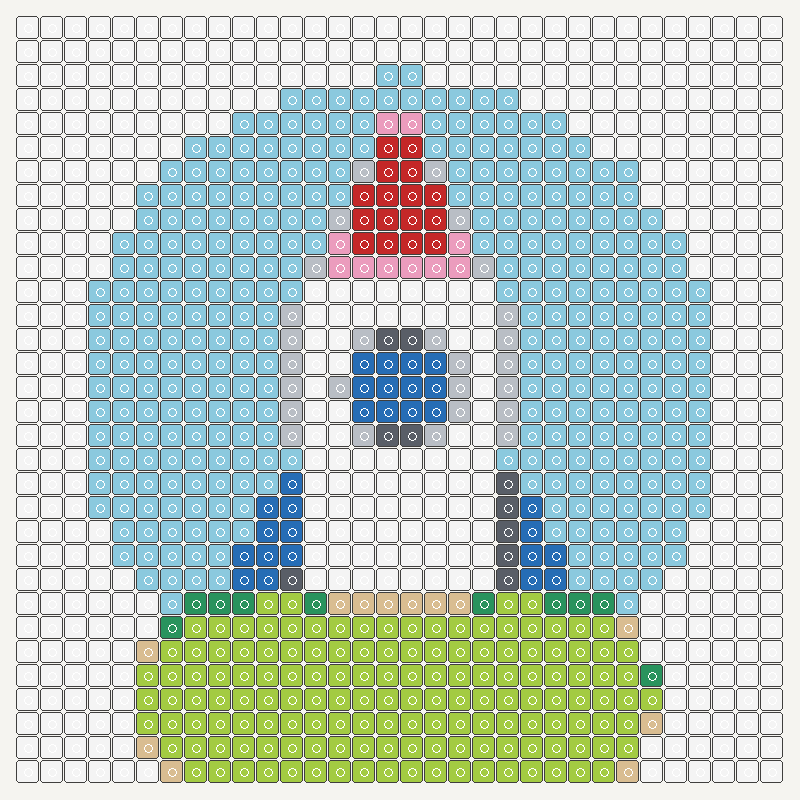

# BrickMosaic AI

[](https://github.com/wangsheng1991/brickmosaic-ai/actions/workflows/tests.yml)

**Looking for the browser-based 3D builder? [Open Image2LEGO →](https://image2lego.com/)** Upload a reference image, inspect an editable brick model, and explore build steps in the web app. This repository is a separate, local-first **2D mosaic** tool—not the web app's source code.

想在线体验图片转 3D 积木模型？[打开 Image2LEGO →](https://image2lego.com/)。本仓库是独立的本地 2D 积木马赛克工具，并非网站源码。

Turn an image into a small, inspectable brick-mosaic plan. Everything runs on your computer. Optional AI background removal isolates the subject with the lightweight **U²-Net `u2netp`** model; a deterministic color-matching step then creates a stud grid, a preview, a printable SVG pattern, and a parts-count CSV.

| Original illustration | 32 × 32 mosaic preview |
| --- | --- |
|  |  |

This is an independent fan-made tool. It is **not affiliated with or endorsed by the LEGO Group**. “LEGO” is a trademark of the LEGO Group. The included colors are approximate visual references, not official color specifications or proof that a part exists in a given color.

## Quick start

Python 3.11–3.13 is supported.

```bash
python3.13 -m venv .venv
source .venv/bin/activate
pip install -e .
brickmosaic photo.jpg --width 48 --max-colors 10 -o output
```

Add local AI foreground extraction when the photo has a distracting background:

```bash
pip install -e '.[ai]'
brickmosaic photo.jpg --width 48 --max-colors 10 --ai-background -o output
```

The first AI run downloads the `u2netp` weights via `rembg`. Your input image is processed locally; the app has no upload or telemetry code. You can also pass a transparent PNG and skip AI. The AI option is explicitly pinned to `u2netp`: we do **not** silently use `rembg`'s current default model, whose weight license may differ. Check model-weight terms before commercial use. See the [rembg usage guide](https://github.com/danielgatis/rembg/blob/main/USAGE.md) and [U²-Net source](https://github.com/xuebinqin/U-2-Net).

AI segmentation is best treated as a draft for photos. It can select the wrong object in cartoons, logos or busy scenes. For illustrations, a transparent PNG without `--ai-background` is usually more predictable; always inspect the resulting grid.

## Outputs

| File | Purpose |
| --- | --- |
| `mosaic.png` | Quick visual preview with circular studs |
| `pattern.svg` | Scalable, numbered grid and color legend for printing |
| `parts.csv` | Approximate count of 1×1 studs per color |
| `plan.json` | Grid coordinates and palette for further tooling |

Transparent or AI-removed background cells are left empty. `--height` overrides aspect-ratio sizing; `--alpha-threshold` controls whether partially transparent cells become empty. `--max-colors` reduces the number of colors to keep the parts list manageable. The matching uses CIE Lab/Delta E 1976 rather than raw RGB distance.

```bash
brickmosaic --help
python examples/make_demo.py
brickmosaic examples/rocket.png --width 32 --max-colors 10 -o output
```

## What this does *not* prove

The grid is a **visual 1×1-stud estimate**, not a purchasable bill of materials or a tested build. It does not verify real part availability, exact manufacturer colors, supporting baseplates, stability, or assembly steps. AI background segmentation can remove details or leave artifacts; review the pattern before ordering parts.

The larger [Image2LEGO](https://image2lego.com/) website explores image-to-3D brick creation. This repository is a separate, reusable mosaic utility; it does not contain the website's private source or service code.

## Development

```bash
pip install -e '.[dev]'
pytest -q
```

Contributions are welcome: better color science, real-world palette adapters with clear provenance, printable instructions, and accessibility improvements are useful next steps. Please avoid submitting copyrighted images or model weights to the repository.

## 中文说明

BrickMosaic AI 是本地运行的“图片转积木马赛克”开源工具。它可以选择用 U²-Net 模型去除背景，再生成预览图、可打印网格、颜色零件数量表和 JSON 数据。输入图片不会上传；首次启用 AI 时会下载模型。颜色和数量仅供设计参考，购买积木前请自行核对真实零件、颜色及搭建稳定性。

基础用法：`brickmosaic 照片.jpg --width 48 --max-colors 10 -o output`；加 `--ai-background` 可启用本地 AI 去背景。

## License

MIT for this repository's code. Third-party packages and model weights have their own licenses.

Background segmentation is provided by [rembg](https://github.com/danielgatis/rembg) using the `u2netp` variant of [U²-Net](https://github.com/xuebinqin/U-2-Net). No model weights are redistributed in this repository.
